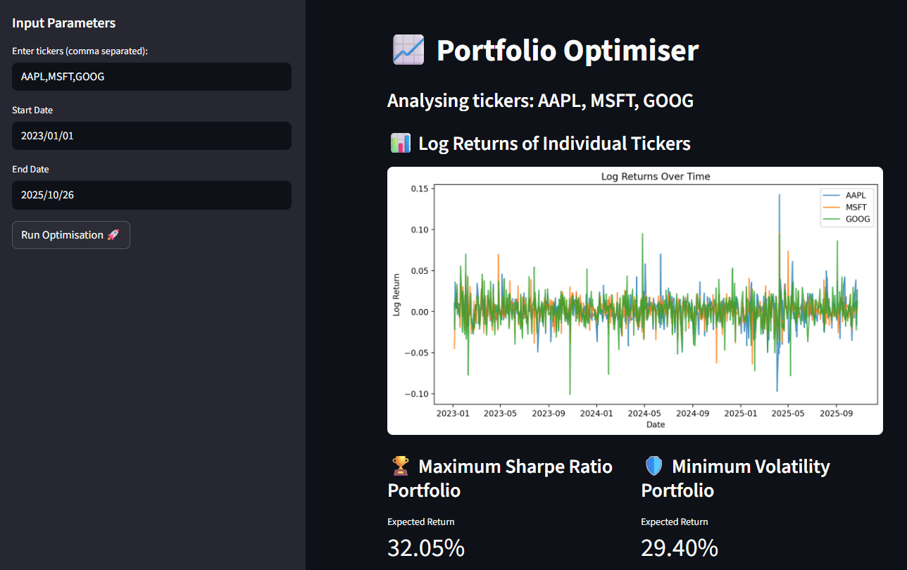
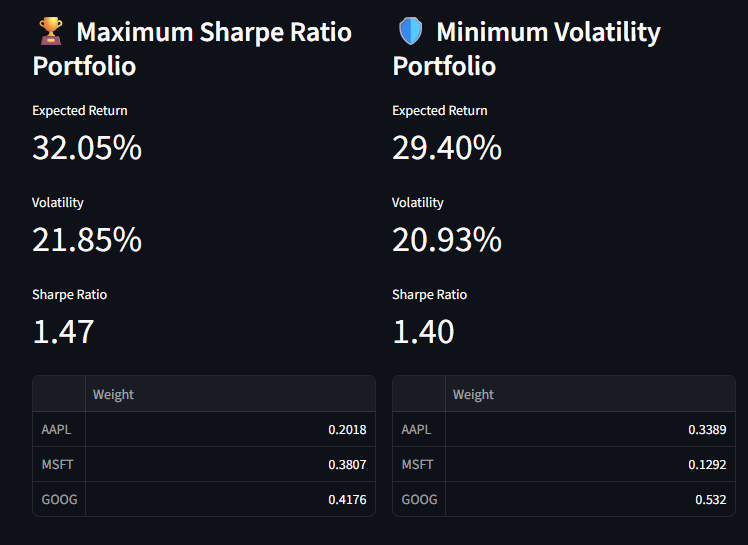
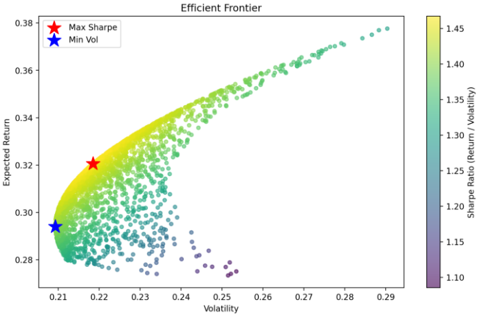

[![Contributors][contributors-shield]][contributors-url]
[![Forks][forks-shield]][forks-url]
[![Stargazers][stars-shield]][stars-url]
[![Issues][issues-shield]][issues-url]
[![LinkedIn][linkedin-shield]][linkedin-url]

# 📈 Portfolio Optimiser

```
______          _    __      _ _         _____       _             _               
| ___ \        | |  / _|    | (_)       |  _  |     | |           (_)              
| |_/ /__  _ __| |_| |_ ___ | |_  ___   | | | |_ __ | |_ _ __ ___  _ ___  ___ _ __ 
|  __/ _ \| '__| __|  _/ _ \| | |/ _ \  | | | | '_ \| __| '_ ` _ \| / __|/ _ \ '__|
| | | (_) | |  | |_| || (_) | | | (_) | \ \_/ / |_) | |_| | | | | | \__ \  __/ |   
\_|  \___/|_|   \__|_| \___/|_|_|\___/   \___/| .__/ \__|_| |_| |_|_|___/\___|_|   
                                              | |                                  
                                              |_|                        
```

An interactive Streamlit application for analysing and optimising investment portfolios.
It allows users to input a list of stock tickers and a date range, then automatically calculates:

- The **Maximum Sharpe Ratio** portfolio (best risk-adjusted return)
- The **Minimum Volatility** portfolio (lowest overall risk)
- The **Efficient Frontier** (set of optimal portfolios)

The app also visualises individual log returns for each asset and the resulting efficient frontier curve — making it an intuitive tool for both investors and data enthusiasts.



### Optmisation Methods

- **Maximum Sharpe Ratio**: Finds the portfolio with the best return-to-risk ratio.
- **Minimum Volatility**: Finds the portfolio with the lowest total volatility.



### Efficient Frontier

The Efficient Frontier is a key concept in Modern Portfolio Theory (MPT) - it represents the set of optimal portfolios that offer the highest expected return for a given level of risk, or equivalently, the lowest risk for a given expected return.



## 🧑‍💻 Tech Stack

![Python]
![Pandas]
![Numpy]
![Plotly]
![Streamlit]
![Matplotlib]
![SciPy]


## 🗓️ Date Selection

When selecting date ranges for portfolio analysis, it’s important to balance relevance and data depth. Short-term ranges (6 months to 1 year) are useful for analysing recent market trends and volatility, while medium-term ranges (2–3 years) provide a broader view that captures more stable performance patterns. Long-term ranges (5–10 years) are ideal for long-term investors seeking to smooth short-term noise and understand risk–return dynamics over multiple market cycles. By default, the app uses the past three years of daily data to provide a good balance between recent and historical insights, though users can adjust the start and end dates in the sidebar to explore different periods as needed.

## 📊 Ticker Selection

To select tickers in the Portfolio Optimiser app, enter one or more stock or ETF symbols in the sidebar input, separated by commas (e.g., `AAPL`, `MSFT`, `GOOG`). Make sure to use the official market symbols and avoid extra spaces or special characters. The app will automatically clean and capitalise the inputs, so users can focus on selecting the assets they want to analyse. It’s best to choose tickers from the same market or exchange for consistency, but you can also combine assets across markets to explore diversification benefits.

## 📦 Getting Started

This project uses [**uv**](https://docs.astral.sh/uv/getting-started/installation/) for dependency management and virtual environments. Please ensure `uv` is installed before proceeding.

### 🔧 Installation

Set up your virtual environment and install dependencies:

```bash
uv venv
uv sync
```

### ✅ Running Tests

To execute unit and integration tests

```bash
invoke test
```

### 🚀 Running the App Locally

To run the app (`main.py`) locally

```bash
invoke run
```

## 👭🏻 Contributing

### Adding Dependencies

```bash
uv add <package>
uv sync
```

### Adding Dev Dependencies
```bash
uv add --dev <package>
uv sync
```

## 🧑‍🤝‍🧑 Developers

| Name           | Email                      |
| -------------- | -------------------------- |
| Tom Aston      | mailto:mail@tomaston.dev     |


<!-- MARKDOWN LINKS & IMAGES -->
<!-- https://www.markdownguide.org/basic-syntax/#reference-style-links -->
[contributors-shield]: https://img.shields.io/github/contributors/TomAston1996/portfolio-optimiser.svg?style=for-the-badge
[contributors-url]: https://github.com/TomAston1996/portfolio-optimiser/graphs/contributors
[forks-shield]: https://img.shields.io/github/forks/TomAston1996/portfolio-optimiser.svg?style=for-the-badge
[forks-url]: https://github.com/TomAston1996/portfolio-optimiser/network/members
[stars-shield]: https://img.shields.io/github/stars/TomAston1996/portfolio-optimiser.svg?style=for-the-badge
[stars-url]: https://github.com/TomAston1996/portfolio-optimiser/stargazers
[issues-shield]: https://img.shields.io/github/issues/TomAston1996/portfolio-optimiser.svg?style=for-the-badge
[issues-url]: https://github.com/TomAston1996/portfolio-optimiser/issues
[license-shield]: https://img.shields.io/github/license/TomAston1996/portfolio-optimiser.svg?style=for-the-badge
[license-url]: https://github.com/TomAston1996/portfolio-optimiser/blob/master/LICENSE.txt
[linkedin-shield]: https://img.shields.io/badge/-LinkedIn-black.svg?style=for-the-badge&logo=linkedin&colorB=555
[linkedin-url]: https://linkedin.com/in/tomaston96
[Python]: https://img.shields.io/badge/python-3670A0?style=for-the-badge&logo=python&logoColor=ffdd54
[Pandas]: https://img.shields.io/badge/pandas-%23150458.svg?style=for-the-badge&logo=pandas&logoColor=white
[AWS]: https://img.shields.io/badge/AWS-%23FF9900.svg?style=for-the-badge&logo=amazon-aws&logoColor=white
[Docker]: https://img.shields.io/badge/docker-%230db7ed.svg?style=for-the-badge&logo=docker&logoColor=white
[FastAPI]: https://img.shields.io/badge/FastAPI-005571?style=for-the-badge&logo=fastapi
[Raspberry Pi]: https://img.shields.io/badge/-Raspberry_Pi-C51A4A?style=for-the-badge&logo=Raspberry-Pi
[NumPy]: https://img.shields.io/badge/numpy-%23013243.svg?style=for-the-badge&logo=numpy&logoColor=white
[Plotly]: https://img.shields.io/badge/Plotly-%233F4F75.svg?style=for-the-badge&logo=plotly&logoColor=white
[Streamlit]: https://img.shields.io/badge/Streamlit-%23FE4B4B.svg?style=for-the-badge&logo=streamlit&logoColor=white
[Matplotlib]: https://img.shields.io/badge/Matplotlib-%23ffffff.svg?style=for-the-badge&logo=Matplotlib&logoColor=black
[SciPy]: https://img.shields.io/badge/SciPy-%230C55A5.svg?style=for-the-badge&logo=scipy&logoColor=%white
